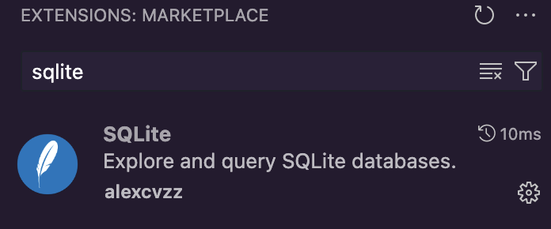
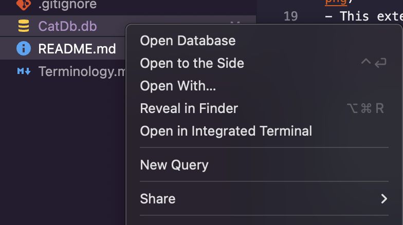
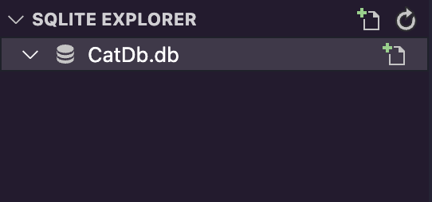
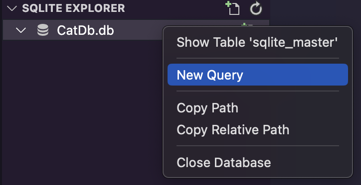
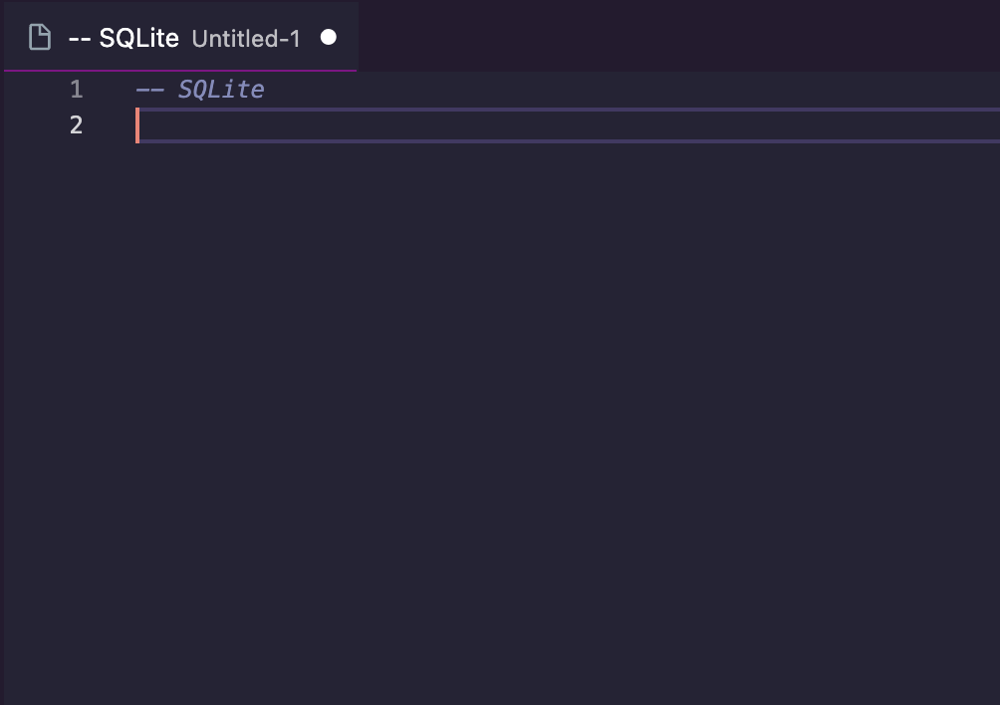
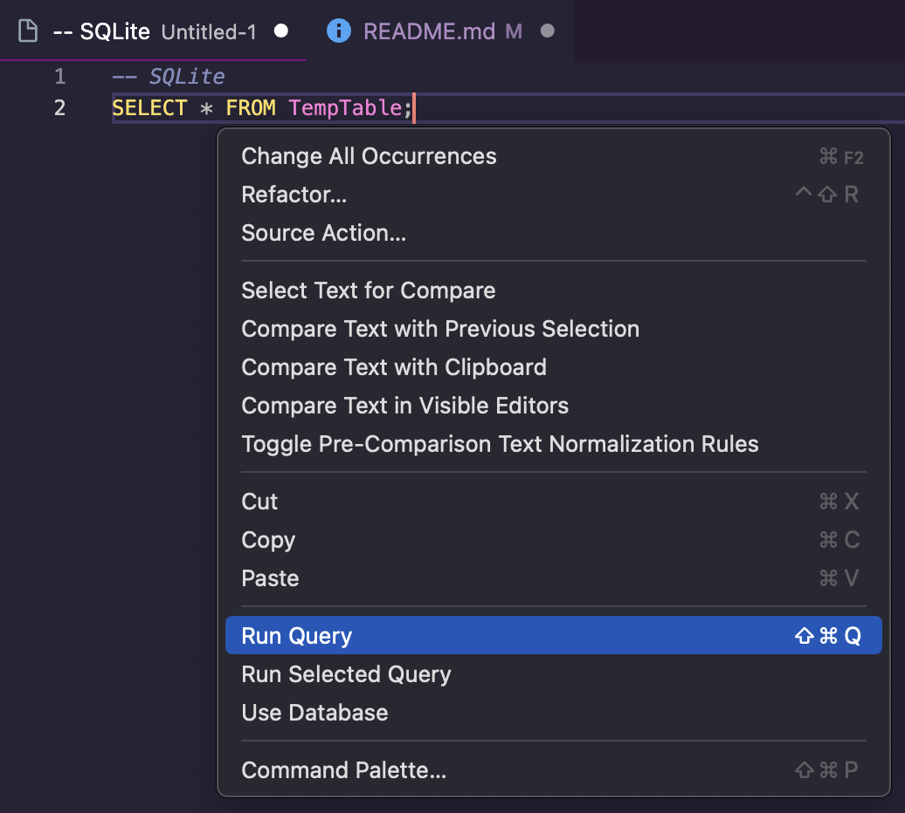

# Code:YOU SQLite Demo and Exercises
Welcome! In this repo, we will go over everything you need to know to get a solid foundation of using databases with SQL. We will be focusing on writing and running queries against CatDB. These exercises are written from the point-of-view of a team of developers working on "Cat App". "Cat App" is a wonderfully-named application targeted for veterinarians to manage their fuzzy patients as well as helpful information on the cat's human servants.

While we will not be covering C#, Javascript, or Python code in this repo, the topics covered here can help you write better, more informed code against SQLite database.

## SQL Terminology
It is recommended that these exercises are used to solidify your understanding of SQL. That being said, if this is completely new to you, that's okay! Check out [the SQL terminology file](./Terminology.md) to familiarize yourself with important terms.

## Recommended Tools
These exercises will not require an extensive knowledge base for using available tools. For our purposes, we just want to view and query the SQLite database. 

### SQLite Extension
The recommended tool to complete these exercises would be a popular [SQLite extension](https://marketplace.visualstudio.com/items?itemName=alexcvzz.vscode-sqlite) for VSCode:
- 
- This extension will allow us to open a connection to CatDB and easily run SQL queries.

### DB Browser for SQLITE
An alternative tool would be [DB Browser for SQLite](https://sqlitebrowser.org).
- WARNING: This tool can get a bit confusing for new users since it utilizes a db-journal file and has a save feature. You are not technically running queries directly against the database.
- It is available to download for Mac, Windows, and Linux.

### Getting Started
- The included CatDB.db file is our entire database in a nice, portable package.
- If using the SQLite extension, after installation, right click on the CatDB.db file and select `Open Database`.
    - 
    - Once the database has been opened, you should see...NOTHING! The included database is empty because you will be populating it as part of the exercises.
        - Check out the new collapsable menu in the explorer panel.
        - 
    - Now that a database connection has been established, right click on it to start running queries. 
        - 
    - A window will appear and this will be there we run our queries.
        - 
    - Running a query is as easy as right clicking in the "white space" and selecting `Run Query`.
        - 

## Repository Structure
- `CatDB.db` is our entire database in one file! 

- The `SQLite_Exercises` directory holds three directories that contain the exercise .sql files. Each script is numbered and should be read/executed in that order. 
    - `Data` directory holds the scripts needed to get the tables and data in place.

    - `Exercises` directory is where the bulk of the learning will take place. There are instructions and documentation in each file as well as example SQL scripts that can be run in the query window.
        - Either copy the queries to the open query window or highlight the script you want to run, right click, and select `Run Selected Query` directly from the exercise script.
    - `Utils` directory is meant mostly as a "last resort". The script in there will wipe and reset the database but should only be used if you are truly stuck. 

No cats were harmed in the making of this demo.